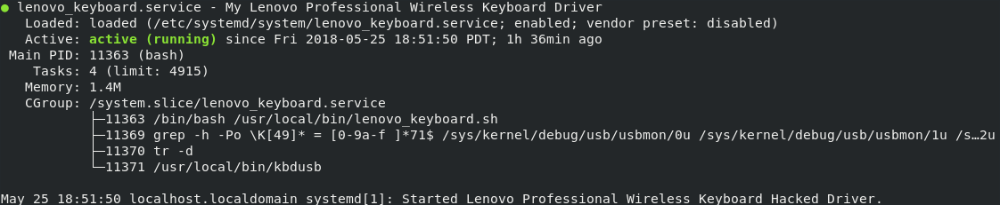

# Linux driver for Lenovo Professional Wireless Keyboard Combo

## Installation    

```bash
git clone https://github.com/carlochess/lenovo_professional_wireless_keyboard.git

cd ~/lenovo_professional_wireless_keyboard

./install.sh

rm -rf ~/lenovo_professional_wireless_keyboard
```
## Repo Details  

`./install.sh` tells systemd to enable and run lenovo_keyboard.service in the background. Thus the levono keyboard will not work before PID(1), e.g. during the hard drive decryption password prompt ([LUKS](https://en.wikipedia.org/wiki/Linux_Unified_Key_Setup)).

The keybindings in `kbdusb.c` are not linked with ASCII in the `mapkey()` function.


### Service Customization  

The `lenovo_keyboard.service` has an **Alias** called, `mykeyboard.service`.

If the `lenovo_keyboard.service` was already enabled and started but would like to option of **changing the name of the alias, proceed with the following**:

```bash
cd /etc/systemd/system

sudo vim lenovo_keyboard.service
```

**Inside vim**:

Change the words after `Alias=` to any name e.g. `Alias=something.service`. Must include `.service` extension.

**Finish with the following example**:

```bash
systemctl reenable something.service
```
**Bash will prompt you for your password**.

After completing the above command, do `systemctl status something.service` to **check if successful**. Below is the expected output:




Some useful guides on creating a systemd service:  
1.  [Creating Systemd Servie Files](https://www.devdungeon.com/content/creating-systemd-service-files)

2. [Systemd Manual](https://www.freedesktop.org/software/systemd/man/systemd.unit.html)

### Main Difference from Forked Origin  

This case does not work with my keyboard:
```c
case 0x32:
  keysent = KEY_BACKSLASH;
  break;
```
Meaning, the <kbd>\\</kbd> and <kdb>|</kdb> keys (the key above <kdb>ENTER</kdb>) does not work. I am unsure of the reason.

So I've simply replaced the <kdb>-</kdb> key on the **Keypad** section of my Lenovo Keyboard with the following:

```c
// changing this to \ (backslash) and | (pipe) on keypad: ( was previously KEY_KPMINUS )
case 0x56:
keysent = KEY_BACKSLASH;
break;
```

Fact: `<kdb>|</kdb>` and `<kdb>ENTER</kdb>` and `<kdb>-</kdb>` do not render as key glyphs on Github Markdown.
> Let me know if there's a way to do this!

### Distro and Kernel Version  

The files on this repo should be able to work on:    

```
Ubuntu: 16.04  
Kernel: 4.10  
```

My Machine Info:

```bash
cat /etc/os-release

NAME=Fedora
VERSION="28 (Workstation Edition)"
ID=fedora
VERSION_ID=28
PLATFORM_ID="platform:f28"
PRETTY_NAME="Fedora 28 (Workstation Edition)"
ANSI_COLOR="0;34"
CPE_NAME="cpe:/o:fedoraproject:fedora:28"

uname -r

kernel-4.16.9-300.fc28.x86_64
```

## Notes on `xev` & `xmodmap`  

This is a great [askubuntu guide](https://askubuntu.com/questions/296155/how-can-i-remap-keyboard-keys) on how to map keys to different symbols on a keyboard with `xmodmap` and using `xev` to test the configuration.

The above guide says to do a reboot so that the `~/.Xmodmap` configuration will take affect, but doing `xmodmap .Xmodmap` will apply the configuration as indicated in the link below.

Use the [Arch Linux wiki on Xmodmap](https://wiki.archlinux.org/index.php/Xmodmap) as additional reference.

**Important**:   

`xev` will show that your configuration is working provided that the askubuntu guide was followed correctly. **However**, the `lenovo_keyboard.service` daemon will override the configurations in the `~/.Xmodmap` file !
